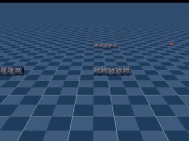
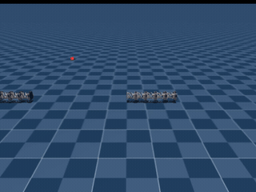
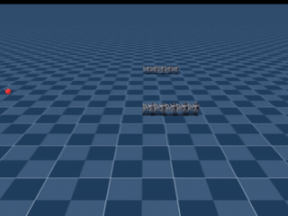
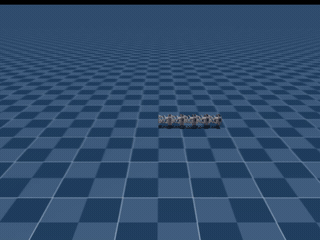
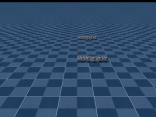
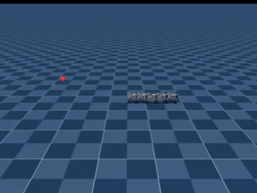

# Snakebot v2 model 1200 goal evaluation

Checkpoint: `logs/rsl_rl/snakebot_locomotion_v2/2026-03-10_19-34-58/model_1200.pt`

## Protocol

- Four deterministic cardinal goals at 0.60 m from the initial robot center of mass, seed `20260903`.
- Six deterministic random far-field XY goals between 1.5 m and 3.0 m, seed `20260904`.
- 20 Hz policy control with a maximum of 75 simulated seconds per goal.
- Observation corruption, domain randomization, and external pushes disabled as in play mode.
- Vector-environment auto-reset disabled so a reached goal can be captured before reset.
- A rollout and its recording stop when the robot COM enters the 0.13 m goal radius.

The checkpoint was trained with a 0.10 m threshold. This evaluation uses the updated 0.13 m stopping radius to match the policy's stable near-goal behavior.

## Cardinal results

| Goal offset | Stopping distance | Reach time |
| --- | ---: | ---: |
| +X | 0.1290 m | 8.60 s |
| +Y | 0.1273 m | 6.00 s |
| -X | 0.1284 m | 6.80 s |
| -Y | 0.1300 m | 7.70 s |

## Far random-goal results

| Goal offset (m) | Initial distance | Stopping distance | Reach time |
| --- | ---: | ---: | ---: |
| (+1.9575, +2.0150) | 2.8093 m | 0.1298 m | 24.50 s |
| (-1.5627, +2.1605) | 2.6664 m | 0.1273 m | 21.20 s |
| (-2.2455, +0.5576) | 2.3137 m | 0.1290 m | 19.60 s |
| (+2.4249, +0.0018) | 2.4249 m | 0.1294 m | 23.05 s |
| (+0.5132, -1.9618) | 2.0279 m | 0.1279 m | 19.10 s |
| (-1.3978, +0.7095) | 1.5675 m | 0.1297 m | 14.35 s |

All ten goals reached the 0.13 m stopping radius within the 75-second limit.

## Recordings

Cardinal goals:

- [+X rollout](./plus_x.mp4)
- [+Y rollout](./plus_y.mp4)
- [-X rollout](./minus_x.mp4)
- [-Y rollout](./minus_y.mp4)

Far random goals:

| 2.81 m goal | 2.67 m goal |
| --- | --- |
|  |  |
| 2.31 m goal | 2.42 m goal |
|  |  |
| 2.03 m goal | 1.57 m goal |
|  |  |

Click an animated preview to open its full H.264 recording.

Machine-readable results are available in [summary.json](./summary.json) and [far_summary.json](./far_summary.json).
